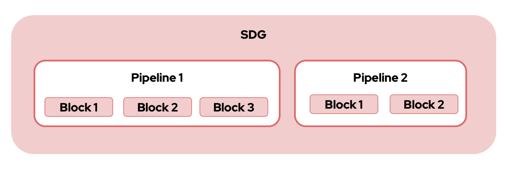

# Synthetic Data Generation (SDG)

## For adding a translation block

### Files modified: 
1. instructlab_sdg/src/instructlab/sdg/pipeline.py
2. instructlab_sdg/src/instructlab/sdg/generate_data.py

### Files/Folders Added:
1. instructlab_sdg/src/instructlab/sdg/pipelines/transpipe (new pipeline)
2. instructlab_sdg/src/instructlab/sdg/blocks/translationblock.py (new block)

### Results
Path: instructlab_sdg/results/nllb_model/

### Config file:
For generation this is the configuration in config.yaml of instructlab

```yaml
# Generate configuration section.
generate:
  # Number of Batches to send for generation on each core.
  # Default: 8
  batch_size: 8
  # Maximum number of words per chunk.
  # Default: 1000
  chunk_word_count: 1000
  # The maximum amount of tokens for the model to generate during knowledge
  # generation. A lower number yields less data but a faster SDG run. It is
  # reccomended to use this on consumer hardware
  # Default: 4096
  max_num_tokens: 4096
  # Teacher model that will be used to synthetically generate training data.
  # Default: /opt/app-root/src/.cache/instructlab/models/mistral-7b-instruct-v0.2.Q4_K_M.gguf
  model: /opt/app-root/src/.cache/instructlab/models/mistralai-7b-instruct-v0.2.Q4_K_M.gguf
  # Number of CPU cores to use for generation.
  # Default: 10
  num_cpus: 10
  # Number of instructions to use
  # Default: -1
  # Deprecated: see 'sdg_scale_factor' instead
  num_instructions: -1
  # Directory where generated datasets are stored.
  # Default: /opt/app-root/src/.local/share/instructlab/datasets
  output_dir: /opt/app-root/src/.local/share/instructlab/datasets
  # Data generation pipeline to use. Available: 'simple', 'full', or a valid path to
  # a directory of pipeline workflow YAML files. Note that 'full' requires a larger
  # teacher model, Mixtral-8x7b.
  # Default: full
  pipeline: transpipe
  # The total number of instructions to be generated.
  # Default: 30
  sdg_scale_factor: 30
  # Branch of taxonomy used to calculate diff against.
  # Default: origin/main
  taxonomy_base: origin/main
  # Directory where taxonomy is stored and accessed from.
  # Default: /opt/app-root/src/.local/share/instructlab/taxonomy
  taxonomy_path: /opt/app-root/src/.local/share/instructlab/taxonomy_mine
  # Teacher configuration
  teacher:
    # Serving backend to use to host the model.
    # Default: None
    # Examples:
    #   - vllm
    #   - llama-cpp
    backend: llama-cpp
    # Chat template to supply to the model. Possible values: 'auto'(default),
    # 'tokenizer', a path to a jinja2 file.
    # Default: None
    # Examples:
    #   - auto
    #   - tokenizer
    #   - A filesystem path expressing the location of a custom template
    chat_template:
    # llama-cpp serving settings.
    llama_cpp:
      # Number of model layers to offload to GPU. -1 means all layers.
      # Default: -1
      gpu_layers: -1
      # Large Language Model Family
      # Default: ''
      # Examples:
      #   - granite
      #   - mixtral
      llm_family: ''
      # Maximum number of tokens that can be processed by the model.
      # Default: 4096
      max_ctx_size: 4096
    # Directory where model to be served is stored.
    # Default: /opt/app-root/src/.cache/instructlab/models/granite-7b-lab-Q4_K_M.gguf
    model_path: /opt/app-root/src/.cache/instructlab/models/granite-7b-lab-Q4_K_M.gguf
    # Server configuration including host and port.
    # Default: host='127.0.0.1' port=8000 backend_type='' current_max_ctx_size=4096
    server:
      # Backend Instance Type
      # Default: ''
      # Examples:
      #   - llama-cpp
      #   - vllm
      backend_type: ''
      # Maximum number of tokens that can be processed by the currently served model.
      # Default: 4096
      current_max_ctx_size: 4096
      # Host to serve on.
      # Default: 127.0.0.1
      host: 127.0.0.1
      # Port to serve on.
      # Default: 8000
      port: 8000
    # vLLM serving settings.
    vllm:
      # Number of GPUs to use.
      # Default: None
      gpus: 2
      # Large Language Model Family
      # Default: ''
      # Examples:
      #   - granite
      #   - mixtral
      llm_family: granite
      # Maximum number of attempts to start the vLLM server.
      # Default: 120
      max_startup_attempts: 120
      # vLLM specific arguments. All settings can be passed as a list of strings, see:
      # https://docs.vllm.ai/en/latest/serving/openai_compatible_server.html
      # Default: []
      # Examples:
      #   - ['--dtype', 'auto']
      #   - ['--lora-alpha', '32']
      vllm_args: [] 

```


The SDG Framework is a modular, scalable, and efficient solution for creating synthetic data generation workflows in a “no-code” manner. At its core, this framework is designed to simplify data creation for LLMs, allowing users to chain computational units and build powerful pipelines for generating data and processing tasks.

## Core Design Principles

The framework is built around the following principles:

1. **Modular Design**: Highly composable blocks form the building units of the framework, allowing users to build workflows effortlessly.
2. **No-Code Workflow Creation**: Specify workflows using simple YAML configuration files.
3. **Scalability and Performance**: Optimized for handling large-scale workflows with millions of records.

---

## Framework Architecture



### Blocks: The Fundamental Unit

At the heart of the framework is the **Block**. Each block is a self-contained computational unit that performs specific tasks, such as:

- Making LLM calls
- Performing data transformations
- Applying filters

Blocks are designed to be:

- **Modular**: Reusable across multiple pipelines.
- **Composable**: Easily chained together to create workflows.

These blocks are implemented in the [src/instructlab/sdg/blocks](src/instructlab/sdg/blocks) directory.

### Pipelines: Higher-Level Abstraction

Blocks can be chained together to form a **Pipeline**. Pipelines enable:

- Linear or recursive chaining of blocks.
- Execution of complex workflows by chaining multiple pipelines together.

There are three default pipelines shipped in SDG: `simple`, `full`, and `eval`. Each pipeline requires specific hardware specifications

#### Simple Pipeline

The [simple pipeline](src/instructlab/sdg/pipelines/simple) is designed to be used with [quantized Merlinite](https://huggingface.co/instructlab/merlinite-7b-lab-GGUF) as the teacher model. It enables basic data generation results on low-end consumer grade hardware, such as laptops and desktops with small or no discrete GPUs.

#### Full Pipeline

The [full pipeline](src/instructlab/sdg/pipelines/full) is designed to be used with [Mixtral-8x7B-Instruct-v0.1](https://huggingface.co/mistralai/Mixtral-8x7B-Instruct-v0.1) as the the teacher model, but has also been successfully tested with smaller models such as [Mistral-7B-Instruct-v0.2](https://huggingface.co/mistralai/Mistral-7B-Instruct-v0.2) and even some quantized versions of the two teacher models. This is the preferred data generation pipeline on higher end consumer grade hardware and all enterprise hardware.

#### Eval Pipeline

The [eval pipeline](src/instructlab/sdg/pipelines/eval) is used to generate [MMLU](https://en.wikipedia.org/wiki/MMLU) benchmark data that can be used to later evaluate a trained model on your knowledge dataset. It does not generate data for use during model training.

---

### YAML-Based Workflow: The Pipeline Configuration

The Pipeline YAML configuration file is central to defining data generation workflows in the SDG Framework. This configuration file describes how blocks and pipelines are orchestrated to process and generate data efficiently. By leveraging YAML, users can create highly customizable and modular workflows without writing any code.

Pipeline configuration must adhere to our [JSON schema](src/instructlab/sdg/pipelines/schema/v1.json) to be considered valid.

#### Key Features of Pipeline Configuration

1. **Modular Design**:
   - Pipelines are composed of blocks, which can be chained together.
   - Each block performs a specific task, such as generating, filtering, or transforming data.

2. **Reusability**:
   - Blocks and their configurations can be reused across different workflows.
   - YAML makes it easy to tweak or extend workflows without significant changes.

3. **Ease of Configuration**:
   - Users can specify block types, configurations, and data processing details in a simple and intuitive manner.

---

### Sample Pipeline Configuration

Here is an example of a Pipeline configuration:

```yaml
version: "1.0"
blocks:
  - name: gen_questions
    type: LLMBlock
    config:
      config_path: configs/skills/freeform_questions.yaml
      output_cols:
        - question
      batch_kwargs:
        num_samples: 30
    drop_duplicates:
      - question
  - name: filter_questions
    type: FilterByValueBlock
    config:
      filter_column: score
      filter_value: 1.0
      operation: eq
      convert_dtype: float
    drop_columns:
      - evaluation
      - score
      - num_samples
  - name: gen_responses
    type: LLMBlock
    block_config:
      config_path: configs/skills/freeform_responses.yaml
      output_cols:
        - response
```

### Data Flow and Storage

- **Data Representation**: Data flow between blocks and pipelines is handled using **Hugging Face Datasets**, which are based on Arrow tables. This provides:
  - Native parallelization capabilities (e.g., maps, filters).
  - Support for efficient data transformations.

- **Data Checkpoints**: Intermediate caches of generated data. Checkpoints allow users to:
  - Resume workflows from the last successful state if interrupted.
  - Improve reliability for long-running workflows.

---

## Installing the SDG library

Clone the library and navigate to the repo:

```bash
git clone https://github.com/instructlab/sdg
cd sdg
```

Install the library:

```bash
pip install .
```

### Using the library

You can import SDG into your Python files with the following items:

```python
 from instructlab.sdg.generate_data import generate_data
 from instructlab.sdg.utils import GenerateException
```

## Repository structure

```bash
|-- src/instructlab/ (1)
|-- docs/ (2)
|-- scripts/ (3)
|-- tests/ (4)
```

1. Contains the SDG code that interacts with InstructLab.
2. Contains documentation on various SDG methodologies.
3. Contains some utility scripts, but not part of any supported API.
4. Contains all the tests for the SDG repository.
