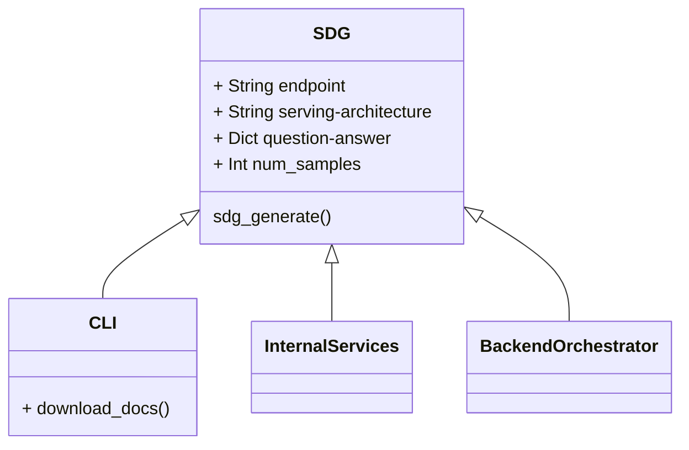

# Instructlab SDG Library Design

(This is a draft, seeking reviews and architectural consensus on the design of the ilab sdg library)

## SDG Library

Library called `sdg` that can be called per q&a pair from various clients.

## Motivation

The motivation behind having a specifc SDG library is to focus the functionality around synthetic data generation.

Various modules of InstructLab like the CLI (`ilab`), backend orchestrator, and other internal services access the SDG tool but the expectations are different from each interface.

What we propose here is a well-defined input and output for the SDG library that only generates the synthetic question and answer pairs and all other peripheral functions happen outside of the core SDG library.

## Parameters

- `url` (String, default = <http://localhost:8080>) : Model endpoint for teacher model served using `arch`
- `arch` (String, default = tgis) : tgis, vllm, llama-cpp
- `[{question:, answer:,context:}]` (list of dicts, required = True): List of dictionary of question answer pairs.
- `path_to_knowledge` (String, default = `knowledge_docs`): Path to folder in current where knowledge docs exist.
- `num_samples` (int, default = 30): Number of samples to generate.
- `task_description` (String, default = ""): Description of q&a task
- `config` : Replace default prompt template configs.
- `cache_dir` (String, default = current dir): Path to the directory where intermediate data files get saved.

## How to import and call the library

```python
from sdg import SynthDataGenerator, gen_data

endpoint = "http://localhost:8080"

client = SynthDataGenerator.from_endpoint(arch="tgis", url=endpoint)

input_dataset = [
    {
        "question": "Which student has the highest difference between their assignment and project scores?",
        "answers": "The student with the highest difference between their assignment and project scores is Mia, with a 3 point difference (94 for the assignment and 97 for the project).",
        "context": "Student Grades,Assignment Scores,Project Scores\nEmma,85,90\nLiam,90,88\nNoah,78,82\nOlivia,92,95\nAva,88,91\nSophia,82,85\nJameson,75,80\nMia,94,97\nWilliam,84,87\nIsabella,89,93",
     }
]


# Generate synthetic data 

gen_dataset = gen_data(client, input_dataset, config=configs, cache_dir="tmp")

print(gen_dataset)
```

This gives generated synthetic questions and answers in a list of dictionaries format.

```jsonl
[{ "task_description": "Teach reading csv format and order by a specific column",
  "generated_context": "Company name,Revenue,Operational income\nFruiter 173,10000000,2400000\nMrony,40000000,2000000\nCoder Inc.,5000000,3000000\nMuppet and Son,173000000,2900000\n",
  "generated_question": "Order the companies based on their operational income.\n",
  "generated_answer": "The highest operational income recorded Coder Inc with 3000000, followed\nby Muppet and Son with 2900000, the third was Fruiter with 2400000 and\nthe lowest income had Mrony with 2000000.\n",
  "context": "Student Grades,Assignment Scores,Project Scores\nEmma,85,90\nLiam,90,88\nNoah,78,82\nOlivia,92,95\nAva,88,91\nSophia,82,85\nJameson,75,80\nMia,94,97\nWilliam,84,87\nIsabella,89,93",
  "inputs": "Which student has the highest difference between their assignment and project scores?",
  "targets": "The student with the highest difference between their assignment and project scores is Mia, with a 3 point difference (94 for the assignment and 97 for the project).",
}]
```

## What happens when this library is called?

The SDG library is called by various clients like `instructlab` (CLI), `backend-sdg`, `internal-service`. The conversion from an available q:a format to the input format required by the SDG CLI is expected to happen client-side.

For each question and answer pair specified as `{question,answer,context}`, the SDG library will generate the required `num_samples` by hitting the model endpoint specified as `client` and provide an output.



## Existing Code References

[https://github.com/instructlab/instructlab/blob/main/src/instructlab/utils.py](https://github.com/instructlab/instructlab/blob/main/src/instructlab/utils.py)
[https://github.com/instructlab/instructlab/tree/main/src/instructlab/generator](https://github.com/instructlab/instructlab/tree/main/src/instructlab/generator)
